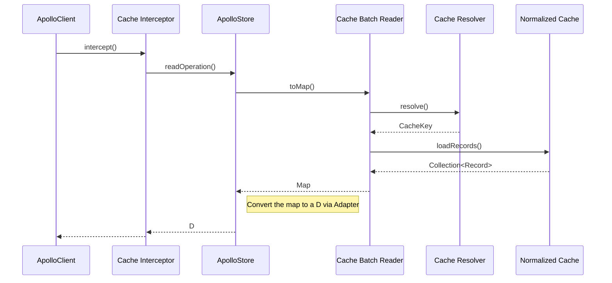
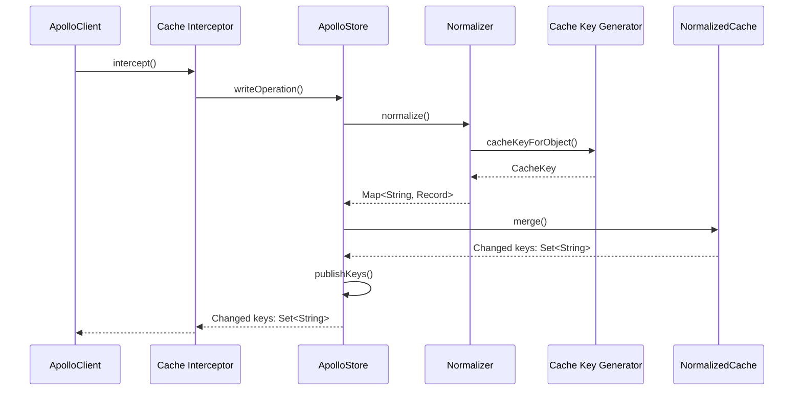

# Normalized cache overview

This lists and describes the main concepts and components of the normalized cache.

## Overview

### Reading from the cache



### Writing to the cache



## Normalization

Normalization is the process of converting a _hierarchical_ key-value data structure into a _flat_ key-record data structure.

An example:

**Before normalization:**

```json
{
  "launches": {
    "cursor": "1605979020",
    "hasMore": true,
    "launches": [
      {
        "__typename": "Launch",
        "id": "109",
        "site": "CCAFS SLC 40",
        "mission": {
          "name": "Starlink-15",
          "missionPatch": "https://images2.imgbox.com/9a/96/nLppz9HW_o.png",
          "__typename": "Mission"
        }
      },
      {
        "__typename": "Launch",
        "id": "108",
        "site": "VAFB SLC 4E",
        "mission": {
          "name": "Starlink-15",
          "missionPatch": "https://images2.imgbox.com/9a/96/nLppz9HW_o.png",
          "__typename": "Mission"
        }
      }
    ]
  }
}
```

**After normalization:**

<table>
<tr>
<th>Cache key</th>
<th>Record</th>
</tr>

<tr>
<td>

`QUERY_ROOT`
</td>
<td>

`{launches({"after":null,"pageSize":2})=CacheKey(launches({"after":null,"pageSize":2}))}`

</td>
</tr>

<tr>
<td>

`launches({"after":null,"pageSize":2})`
</td>
<td>

`{cursor=1605979020, hasMore=true, launches=[CacheKey(Launch:109), CacheKey(Launch:108)]}`

</td>
</tr>

<tr>
<td>

`Launch:109`
</td>
<td>

`{__typename=Launch, id=109, site=CCAFS SLC 40, mission=CacheKey(Mission:Starlink-15)}`

</td>
</tr>

<tr>
<td>

`Mission:Starlink-15`
</td>
<td>

`{name=Starlink-15, missionPatch({"size":"SMALL"})=https://images2.imgbox.com/9a/96/nLppz9HW_o.png, __typename=Mission}`

</td>
</tr>

<tr>
<td>

`Launch:108`
</td>
<td>

`{__typename=Launch, id=108, site=VAFB SLC 4E, mission=CacheKey(Mission:Starlink-15)}`

</td>
</tr>

</table>

In this example we can see an advantage of normalization: both launches `109` and `108` reference the same mission `Starlink-15`, which is stored only once.

### `Record`

Each **record** is a key-value map, where the values can be:
- null
- scalar
- reference to another record (<- this is where the "flattening" happens)
- a list of these

Note: scalars can be maps when they are custom scalars.

They are represented by the `Record` class - essentially a `Map<String, Any?>`.

### `Normalizer`

The normalization process is implemented in the `Normalizer` class. It is instantiated by `ApolloStore` when writing to the cache, the resulting `Record`s are then passed to the `NormalizedCache`.

The `normalize()` method returns a `Map<String, Record>`.

## Cache

### `NormalizedCache`

This is the low-level API providing methods to store ("merge") and retrieve ("load") `Record`s. It is an abstract class which currently has 3 implementations:
- `MemoryCache`: in-memory
- `SqlNormalizedCache`: uses SQLite
- `OptimisticCache`: handles optimistic updates as a front-end to another NormalizedCache (NormalizedCaches can be chained)

It implements the `ReadOnlyNormalizedCache` interface which exposes the `loadRecord` / `loadRecords` methods.

The main methods are:
- `loadRecord(key: String): Record?`
- `loadRecords(keys: Collection<String>): Collection<Record>`
- `merge(record: Record): Set<String>`
- `merge(records: Collection<Record>): Set<String>`

Instantiation is done by passing a `NormalizedCacheFactory` to the `ApolloClient` builder. The factory will be invoked from inside `ApolloStore`'s init.

### `ApolloStore`

This is a higher-level API that sits on top of the `NormalizedCache` API. This one doesn't deal with `Record`s but is at the `Operation` / `Fragment` level.

It is an interface with one implementation: `DefaultApolloStore`.

The main methods are:

- `readOperation(operation: Operation<D>): D`
- `readFragment(fragment: Fragment<D>): D`
- `writeOperation(operation: Operation<D>, operationData: D): Set<String>`
- `writeFragment(fragment: Fragment<D>, cacheKey: CacheKey, fragmentData: D): Set<String>`

Also exposes a `changedKeys` Flow allowing to monitor (watch) changes in the store.

An instance is created when building the `ApolloClient` and held by the `ApolloCacheInterceptor` (and `WatcherInterceptor`).

## Record merging

When a `Record` is stored in the cache, it is _merged_ with the existing one at the same cache key (if any):
- existing fields are replaced with the new value
- new fields are added

This is implemented by the `Record.mergeWith` method.

## Keys

### `CacheKey`

Represents a key in the normalized cache. When used as a reference inside a `Record`, its representation will be of the form `ApolloCacheReference{...}`.

For a normalized cache to work well, `Record`s should be uniquely identified by a key that's a function of the object it represents, typically its id. By default, the `CacheKey` will be the path of the field in its parent, which can lead to duplications.

`CacheKeyGenerator` and `CacheResolver` are the APIs used to customize the `CacheKey` generation.

### `CacheKeyGenerator`

Responsible for creating `CacheKey`s from JSON payloads coming from the network, during normalization, before storage.

An instance of this interface can be passed to the `ApolloClient` builder, it is then held by the `DefaultApolloStore` and passed to the `Normalizer` when normalizing.  The default value is `TypePolicyCacheKeyGenerator`.

Returns `null` if an object doesn't have an id (the path will be used as the key).

### `TypePolicyCacheKeyGenerator`

The default implementation of `CacheKeyGenerator`. It generates `CacheKey`s from the key fields declared on a type, via the `@typePolicy` directive.

### `CacheResolver`

Responsible for _resolving_ fields from the cache. The `resolveField` method is called for each field of an operation when trying the cache (usually this happens before making a network request).

The field's parent `Record` from the cache is passed as an argument.

It can return either:

- a `CacheKey`
- a value that can can be inside a `Record`
- or throw `CacheMissException`

An instance can be passed to the `ApolloClient` builder, it is then held by the `DefaultApolloStore` and passed to the `CacheBatchReader` when reading the cache. The default value is `FieldPolicyCacheResolver`.

### `DefaultCacheResolver`

The 'fallback' implementation of `CacheResolver`. It looks up the field in the parent, and throws `CacheMissException` if it's not found.

### `FieldPolicyCacheResolver`

The default implementation of `CacheResolver`. It generates `CacheKey`s from the key arguments declared on an operation, via the `@fieldPolicy` directive.

Falls back to `DefaultCacheResolver` if no key arguments are found.

### `CacheKeyResolver`

A helper implementation of `CacheResolver` intended to simplify its usage. It declares abstract methods that return `CacheKey`s from a field and variables.


## Internals

### `CacheBatchReader`

This is where the reading of the cache happens. It takes as inputs:
- a `ReadOnlyNormalizedCache`
- the list of `CompiledSelection` (the fields to read) of the operation to read
- the `CacheResolver`

It is invoked from ApolloStore's `readOperation` / `readFragment` methods.

### `CacheHeaders`

A `Map<String, String>` used to communicate extra information or configuration when reading from / writing to the cache. They are passed around to most methods. Examples of use are `DO_NOT_STORE` and `EVICT_AFTER_READ`.

They can be set on `ApolloResponse` and `ApolloRequest`.

### `ApolloCacheInterceptor`

This is where the `ApolloStore` is actually used to read from / store into the cache.

Also responsible for providing `CacheInfo` (duration info, cache hit or not, etc.).

Is instantiated and set when calling `ApolloClient.Builder` `.store` or `.normalizedCache`.

### `WatcherInterceptor`

Uses `ApolloStore.changedKeys` to monitor changes in the cache. At each change, it proceeds to the next interceptor, which is `ApolloCacheInterceptor`.
