> ⚠️ **Nullability annotations are not part of the specification and are subject to change.** If you have feedback on them, please let us know via [GitHub issues](https://github.com/apollographql/apollo-android/issues/new?assignees=&labels=Type%3A+Bug&template=bug_report.md&title=[Data%20Builders]), in the [Kotlin Slack community](https://slack.kotl.in/), or in the [GraphQL nullability working group](https://github.com/graphql/nullability-wg/). 

## Nullability in GraphQL

GraphQL does not have a `Result` type. If a field errors, it is set to `null` in the JSON response and an error is added to the `errors` array. 

With the following schema and query:

```graphql
type User {
  id: ID!
  # name is nullable, but in practice this happens only in error cases
  name: String
  avatarUrl: String
}

query GetUser {
  user {
    id
    name
    avatarUrl
  }
}
```

The server returns the following response in case of error:

```json
{
  "data": {
    "user": {
      "id": "1001",
      "name": null,
      "avatarUrl": "https://example.com/pic.png"
    }
  },
  "errors": [
    {
      "message": "Cannot resolve user.name",
      "path": ["user", "name"]
    }
  ]
}
```

GraphQL best practices recommend using nullable types by default. From [graphql.org](https://graphql.org/learn/best-practices/#nullability):

```
In a GraphQL type system, every field is nullable by default. 
This is because there are many things that can go awry in a networked
service backed by databases and other services.
```

This default makes sense in distributed environments where microservices might fail and some data fail to resolve. This behaviour is robust by default: if part of your query fails, you still get the rest of the data.

This default has one major drawback for frontend developers though. It requires to carefully check every field in your UI code. 

Sometimes it's not clear how to handle the different cases:

```kotlin
@Composable
fun User(user: GetUserQuery.User) {
  if (user.name != null) {
    Text(text = user.name)
  } else {
    // What to do here? 
    // Is it an error? 
    // Is it a true null?
    // Should I display a placeholder? an error? hide the view?
  }
}
```

To help deal with those issues and make sure your UI code only sees what make sense for your app, Apollo Kotlin offers three tools:
* [Error aware parsing](#error-aware-parsing)
* [`@catch`](#handle-errors-and-receive-partial-data-with-catch)
* [`@semanticNonNullField`](#handle-semantic-non-null-with-semanticnonnullfield)

These tools change effectively the GraphQL default from "handle every field error" to "opt-in the errors you want to handle".

## Nullability in Apollo Kotlin

### Error aware parsing

With error aware parsing, the errors are detected at parsing time, so you don't have to look them up in the `errors` array. Any GraphQL error stops the parsing and you are guaranteed that `response.data` is actual semantic data and does not contain any error. 

In order to opt-in error aware parsing, create an `extra.graphqls` file next to your schema and import the `@catch` directive:

```graphql
# Import the `@catch` directive definition. 
# When it is imported, parsers generate extra code to deal with errors.
extend schema @link(
  url: "https://specs.apollo.dev/nullability/v0.2", 
  import: ["@catch", "CatchTo"]
)
```

And choose your default error handling. You can choose to coerce errors to `null`, like the current GraphQL default:

```graphql
# Coerce errors to null by default. Partial data is returned. This partial data may contain errors that need to be checked
# against the `errors` array
extend schema @catch(to: NULL)
```

Or re-throw errors:

```graphql
# Errors stop the parsing. The data never contains error. Use `@catch` in operations to let partial data through
extend schema @catch(to: THROW)
```

In the `@catch(to: THROW)` mode, the parsing stops at the first GraphQL error and the whole query is failed. In the example above:

```json
{
  "data": {
    "user": {
      "id": "1001",
      "name": null,
      "avatarUrl": "https://example.com/pic.png"
    }
  },
  "errors": [
    {
      "message": "Cannot resolve user.name",
      "path": ["user", "name"]
    }
  ]
}
```

`response.data` is null and `response.exception` is an instance of `ApolloGraphQLException`:

```kotlin
println(response.data) // null
println(response.exception) // ApolloGraphQLException 
```

This default makes it easy to handle errors as they are all handled at parsing time. 
Any `null` in the response is guaranteed to be a semantic null and not an error, and you should probably handle it.

> Note: if you have existing code that uses partial data, you can use [`@ignoreErrors`](#migrate-progressively-with-ignoreerrors) to disable throwing on a query
> per query basis.

Sometimes failing the whole query feels a bit overkill though. For those cases, you can handle errors with `@catch`.

### Handle errors and receive partial data with `@catch`

In some cases, you might want to display the data returned from the server, even if it is partial. 

To do so, catch GraphQL errors using the `@catch` directive:

```graphql
query GetUser {
  user {
    id
    # map name to FieldResult<String?> instead of stopping parsing
    name @catch
    avatarUrl
  }
}
```

Instead of failing the whole query, the `name` field is now generated as a `FieldResult<String?>` class that can contain either a nullable value or an error:

```kotlin
// name does not have a value
println(response.data?.user?.name?.valueOrNull) // null
// but name has an error
println(response.data?.user?.name?.graphQLErrorOrNull?.message) // "Cannot resolve user.name"
// partial data is available
println(response.data?.user?.id) // "42"
// exception is null
println(response.exception) // null
```

For fields of List type, `@catch` applies only to the first level. If you need to apply it to a given level, use the `levels` argument:

```graphql
query GetUser {
  user {
    # socialLinks fails the operation on error 
    # socialLinks[0], socialLinks[1], socialLinks[2], etc... are mapped to FieldResult classes
    socialLinks @catch(levels: [1])
  }
}
```

For fields of composite type, `@catch` catches any nested error:

```graphql
query GetUser {
  # catch errors on user and any nested field 
  user @catch(to: RESULT) {
    name 
    avatarUrl
  }
}
```

Response:

```json
{
  "data": {
    "user": {
      "id": "1001",
      "name": null,
      "avatarUrl": "https://example.com/pic.png"
    }
  },
  "errors": [
    {
      "message": "Cannot resolve user.name",
      "path": ["user", "name"]
    }
  ]
}
```

`data.user` is a `FieldResult<User>`:

```kotlin
// user is a FieldResult<User> that contains the name error
println(response.data?.user?.graphQLErrorOrNull?.message) // "Cannot resolve user.name"
```

### Handle semantic non-null with `@semanticNonNullField`

Even with automatic detection of errors and handling of partial data like described above, you still have to check for `null` in your UI code. This is because of the same reason that [GraphQL by default recommends nullable fields](https://graphql.org/learn/best-practices/#nullability). Your backend team has no other choice than make a field nullable if it can fail. 

But a field like 'User.name' is _semantically non-null_: it should never be `null`, except when something goes really wrong.

In those cases, you can mark a field as "semantic non-null" and the Apollo Kotlin compiler will generate it as non-nullable even though it is nullable in the server schema. To do so, add `@semanticNonNullField` to your `extra.graphqls` file:

```graphql
# extra.graphqls

# Import the `@semanticNonNull` directive definition in addition to `@catch` and `CatchTo`. 
extend schema @link(
  url: "https://specs.apollo.dev/nullability/v0.2", 
  import: ["@catch", "CatchTo", "@semanticNonNullField"]
)

# mark User.name as semantic non-null
extend type User @semanticNonNullField(field: "name")
```

`name` is now a non-null Kotlin types:

```kotlin
class User(
    val id: String,
    // name is non-null here
    val name: String,
    val avatarUrl: String?,
)
```

If, by any chance, an error happens that you still want to handle on that field, you can use `@catch` to map `name` to a `FieldResult<String>` property containing a non-null value or an error.

```kotlin
user.name.valueOrNull // "Luke Skywalker"
user.name.graphQLErrorOrNull // null
```

Similarly to `@catch`, `@semanticNonNullField` supports a `levels` argument for lists:

```graphql
# User.friends is generated a nullable
# User.friends[0], User.friends[1], User.friends[2], etc.. is generated a non-null
extend type User @semanticNonNullField(field: "friends", levels: [1])
```

## Migrate progressively with `@ignoreErrors`

`@ignoreErrors` is an operation directive that disables error aware parsing for a specific operation:

```graphql
"""
Never throw on errors.

This is used for backward compatibility for clients where this was the default behaviour.
"""
directive @ignoreErrors on QUERY | MUTATION | SUBSCRIPTION
```

To enable it, import it like `@catch`, `CatchTo` and `@semanticNonNullField`:

```graphql
extend schema @link(
  url: "https://specs.apollo.dev/nullability/v0.2",
  import: ["@catch", "CatchTo", "@semanticNonNullField", "@ignoreErrors"]
)
```

Enabling error aware parsing and adding `@ignoreErrors` to all your operations is a no-op. You can then remove `@ignoreErrors` from your operations progressively. 

## Decision flowchart 

Different teams have different needs:

* Some teams have a schema where a lot of fields are non-null already and might know from their backend team that all the nullable ones are semantic nulls. For those teams, there is little value in using `@catch` or `@semanticNonNullField`.
* Other teams have a schema where fields are all nullable by default, according to the GraphQL best practices.
  * Some of them want to display as much data as possible always. The frontend team needs to check for errors on every field and this makes the experience very robust at the price of more complex client code.
  * Some of them want to opt-in the errors they want to handle and save the code to check every field.

Finally, some teams want to opt-in error aware parsing without breaking their existing codebase. For those cases, `@ignoreErrors` allows a more progressive solution.

```mermaid
flowchart TD
    A("Are you happy with the current nullability\nand error handling?") --> |YES| B["Do nothing"]
    B --> V
    A --> |NO| D["Import the `@catch` directive"]
    D --> E("Do you want partial data by default?")
    E --> |partial data by default| F["Coerce to null by default\nextend schema @catch(to: NULL)"]
    F --> X["Things are mostly unchanged\nbut you can now use `@catch`"]
    X --> J["Use `@catch(to: RESULT)`\nin your operations\nto get the inline errors\nin your Kotlin code"]
    J --> H("Do you have fields in your schema\nthat are nullable only for error reasons?")
    H --> |no|V
    H --> |yes|I["import the `@semanticNonNullField` directive"]
    I --> K["Add `@semanticNonNullField`\nto appropriate fields in your schema"]
    K --> L["Those field are now generated\nas non-null in Kotlin"]
    L --> V["The end 🎉"]
    E --> |no-errors by default| P["Rethrow by default\nextend schema @catch(to: THROW)"]
    P --> W["Errors stop the parsing.\nresponse.data is now error-free"]
    W --> G("Do you have existing code that\nhandles partial data?")
    M --> R["Consider a single\n`@ignoreErrors` operation"]
    R --> O["Catch errors with\n`@catch(to: RESULT)`\nin your operations\nand let partial data through"]
    O --> |test|Q("Is it working as expected?")
    Q --> |yes|S["Remove `@ignoreErrors`"]
    S --> T("Are there any `@ignoreErrors`\noperations left?")
    T --> |yes|R
    T --> |no|H
    Q --> |no|O
    G --> |yes| M["Add `@ignoreErrors` to every\noperation"]
    G --> |no|N["Use `@catch(to: RESULT)`\nin your operations\nto get the inline errors\nin your Kotlin code"]
    N --> H
```


