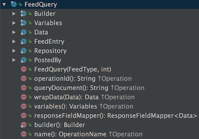

Apollo-Android is a GraphQL compliant client that generates Java models from standard GraphQL queries.  These models give you a typesafe API to work with GraphQL servers. Apollo will help you keep your GraphQL query statements together, organized, and easily accessible from Java.

When you change a query and recompile your project - the Apollo code generator will rebuild your data model for you. Code generation also allows Apollo to read and unmarshal responses from the network without the need of any reflection.

<h2 id="installation">Installation</h2>

The latest Gradle plugin version is [  ](https://bintray.com/apollographql/android/apollo-gradle-plugin/_latestVersion)

To use this plugin, add the dependency to your project's `build.gradle` file:

```groovy
buildscript {
  repositories {
    jcenter()
  }
  dependencies {
    classpath 'com.apollographql.apollo:apollo-gradle-plugin:x.y.z'
  }
}

dependencies {
  compile 'com.apollographql.apollo:apollo-runtime:x.y.z'
}
```

The plugin can then be applied as follows within your app module's `build.gradle` file:

```
apply plugin: 'com.apollographql.android'
```

> Note: The Android plugin must be applied before the Apollo plugin

<h2 id="download-schema">Downloading a Schema</h2>

Apollo Android requires a GraphQL schema file as input to the code generation process. A schema file is a JSON file that contains the results of an introspection query. Conventionally this file is called `schema.json`, and you store it next to your `.graphql` files. Most users keep these files in the `/src/main/graphql` directory.


You can use [apollo-codegen](https://github.com/apollographql/apollo-codegen#usage) to download a GraphQL schema. This works by sending an introspection query to your server:

```sh
apollo-codegen download-schema http://localhost:8080/graphql --output schema.json
```

If needed, you can use the `header` option to add additional HTTP headers to the request. For example, to include an authentication token, use `--header "Authorization: Bearer <token>"`:

```sh
apollo-codegen download-schema https://api.github.com/graphql --output schema.json --header "Authorization: Bearer <token>"
```

> Note: In the sample project you can find the schema here => `apollo-sample/src/main/graphql/com/apollographql/apollo/sample/schema.json`.

<h2 id="creating-client">Creating a Client</h2>

With the installation complete and schema downloaded, let's create your Apollo Client. In most cases, you’ll want to create a single shared instance of `ApolloClient` and point it at your GraphQL server. `ApolloClient` uses `OkHttp` under the hood for handling network requests. So you will need to create an instance of the `OkHttpClient` and pass it to the `ApolloClient` builder.

```java
private static final String BASE_URL = "<your_server>/graphql";

OkHttpClient okHttpClient = new OkHttpClient.Builder().build();

ApolloClient apolloClient = ApolloClient.builder()
                                        .serverUrl(BASE_URL)
                                        .okHttpClient(okHttpClient)
                                        .build();
```

If you need to send header values with your GraphQL requests, you can add those to your `OkHttpClient` instance by means of an [Interceptor](https://github.com/square/okhttp/wiki/Interceptors).

> Note: In the sample project you can find the client here => `apollo-sample/src/main/java/com/apollographql/apollo/sample/GitHuntApplication.java`.

That's it! Now your client is ready to start fetching data. 

<h2 id="creating-graphql-file">Creating a .graphql File</h2>

The Apollo Android plugin works by generating code that corresponds to the GraphQL queries you specify in your application's `.graphql` files. There is nothing Android specific about these queries, they can be used with other GraphQL clients as well. It is however important to have a name for your query to avoid compilation failures.

So if you wanted to perform the below query, you would place it in a file that ends in `.graphql`. It's common to use the query name as the file name. So in this case your file would be named, `FeedQuery.graphql`.

```graphql
query FeedQuery($type: FeedType!, $limit: Int!) {
  feedEntries: feed(type: $type, limit: $limit) {
    id
    repository {
      name
    }
    postedBy {
      login
    }
  }
}
```

> Note: For the sample project you can find the `.graphql` files here => `apollo-sample/src/main/graphql/com/apollographql/apollo/sample`.

<h2 id="code-generation">Code Generation</h2>

To have Apollo generate the appropriate Java classes for you, you will need to compile your code. Based on your downloaded `schema.json` file and the contents of your `.graphql` files you will have generated Java classes in the following directory `build/generated/source/apollo`. There will be one Java class for each of your queries with nested classes for reading the network response.



> Note: These are Apollo generated files. Therefore they **should not** be modified.

<h2 id="consuming-code">Consuming Code</h2>

You can use the generated classes to make requests to your GraphQL API. `ApolloClient` can take as input any *Query* or *Mutation* that you have generated using Apollo.

First, you would create an instance of your desired query or mutation class. This class was generated for you as part of the Apollo code gen process. You can either use the associated `builder()` method or create the class directly via its constructor.

```java
FeedQuery feedQuery = FeedQuery.builder()
                               .limit(10)
                               .type(FeedType.HOT)
                               .build()
```

Then you can pass that query into the `query()` method available on the `ApolloClient` instance and enqueue your request. Once the request is completed you will have access to the data inside of the `onResponse()` method. Mutations work in the same way, except that you would use the `mutate()` method on the `ApolloClient` instance.

```java
apolloClient.query(feedQuery).enqueue(new ApolloCall.Callback<FeedQuery.Data>() {

  @Override public void onResponse(@NotNull Response<FeedQuery.Data> dataResponse) {

    final StringBuffer buffer = new StringBuffer();
    for (FeedQuery.Data.Feed feed : dataResponse.data().feed()) {
      buffer.append("name:" + feed.repository().fragments().repositoryFragment().name());
      buffer.append(" owner: " + feed.repository().fragments().repositoryFragment().owner().login());
      buffer.append(" postedBy: " + feed.postedBy().login());
      buffer.append("\n~~~~~~~~~~~");
      buffer.append("\n\n");
    }

    MainActivity.this.runOnUiThread(new Runnable() {
      @Override public void run() {
        TextView txtResponse = (TextView) findViewById(R.id.txtResponse);
        txtResponse.setText(buffer.toString());
      }
    });
      
  }

  @Override public void onFailure(@NotNull Throwable t) {
    Log.e(TAG, t.getMessage(), t);
  }
});       
```

In this example, we loop over the results and append them to a `StringBuffer`. Finally, we display the string inside of a `TextView` on the main thread.

> Note: `onResponse()` returns on a background thread. If you want to make UI updates make sure they are done on the Main Thread.

Congrats, you're all set up with Apollo Android!