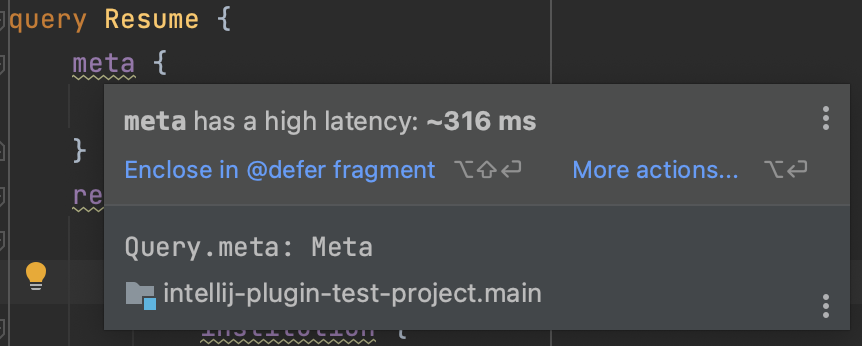

To help your day-to-day development with Apollo Kotlin, a plugin for Android Studio and IntelliJ is available.

## Installation

The plugin is available on the JetBrains plugin repository. To install it from the IDE, go to
<kbd>Settings</kbd> | <kbd>Plugins</kbd> | <kbd>Marketplace</kbd> | search for "Apollo GraphQL" | <kbd>Install</kbd>

At the time of writing, the plugin is supported on:

- IntelliJ 2024.2.1 and above
- Android Studio 2024.2.1 (Ladybug) and above

Please check the [plugin page](https://plugins.jetbrains.com/plugin/20645-apollo-graphql) for up to date information.

## Features

### Automatic code generation

The plugin automatically generates models whenever GraphQL files change.
This means you don't need to manually run `./gradlew generateApolloSources` after editing the files.

Note: this works by running Gradle in continuous mode, and can be disabled in the plugin settings.

<WistiaEmbed videoId="nf10iaupuj"/>

### Integration with the GraphQL IntelliJ Plugin

The plugin depends on and integrates with the [GraphQL IntelliJ Plugin](https://plugins.jetbrains.com/plugin/8097-js-graphql).
The file structure of the Apollo project is automatically contributed, so there is no need to create a `graphql.config.yml` / `.graphqlconfig` file.

<WistiaEmbed videoId="fp8zqezcty"/>

### Navigation

#### Kotlin → GraphQL

When editing Kotlin code,  icons will appear next to references to generated operation and fragment classes.
Clicking on them will navigate to the corresponding GraphQL definition.

You can also go to the GraphQL definition with <kbd>Cmd</kbd> Click (Mac) or <kbd>Ctrl</kbd> Click (Windows / Linux) on an operation, field, enum, etc.

<WistiaEmbed videoId="7eflcnw1zc"/>

#### GraphQL → Kotlin

You can search for code usages of a GraphQL operation, fragment, enum type/value and input type/field, with right click | <kbd>Find Usages</kbd>.

<WistiaEmbed videoId="7wp1odktye"/>

### Unused operations / fields

In GraphQL files, operations and fields are shown in grey if the corresponding generated code is not used in your project.

<WistiaEmbed videoId="s6yhssdpb4"/>

### Migration helpers

In the <kbd>Refactor</kbd> | <kbd>Apollo</kbd> menu, you can find helpers to migrate your project:

- Apollo Android 2.x → Apollo Kotlin 3.x
- `compat` codegen → `operationBased` codegen
- Apollo Kotlin 3.x → Apollo Kotlin 4.x

Note: while these helpers will automatically update your code when possible, there are some cases where this isn't possible and manual changes are required.
Please refer to the migration guides ([3.x](../migration/3.0/), [4.x](../migration/4.0/)) when upgrading.

<WistiaEmbed videoId="utkyl1uypx"/>

### Download schema

Download the latest version of your schema(s) by going to <kbd>Tools</kbd> | <kbd>Apollo</kbd> | <kbd>Download schema</kbd>.

This uses the Introspection endpoint or the Registry that you can [configure](../advanced/plugin-configuration#downloading-a-schema) on your Apollo service. 

### Open in Apollo Sandbox

You can open a GraphQL file in [Apollo Sandbox](https://studio.apollographql.com/sandbox/explorer) with right click | <kbd>Open in</kbd> | <kbd>Apollo Sandbox</kbd>.
This is a handy way to share operations with coworkers for instance. There, they will be able to execute the operation and see the result.

This is also accessible from the  button at the top of the editor.

### High latency fields

If your project uses Apollo GraphOS, the plugin can use the collected metrics (["Field Insights"](https://www.apollographql.com/docs/graphos/metrics/field-usage)) and report a warning on fields that have a high latency.

By default, fields with a latency above 100ms will be highlighted. You can change this threshold in <kbd>Settings</kbd> | <kbd>Editor</kbd> | <kbd>Inspections</kbd> | <kbd>GraphQL</kbd> | <kbd>Apollo GraphOS</kbd> | <kbd>High latency field</kbd>.

A quick fix is available to encapsulate the field in a fragment with the [`@defer`](../fetching/defer) directive.

For the plugin to be able to fetch the metrics, you need to configure your project with its [Apollo GraphOS API key](https://www.apollographql.com/docs/graphos/api-keys/). To do this, go to the plugin's settings: <kbd>Settings</kbd> | <kbd>Languages & Frameworks</kbd> | <kbd>GraphQL</kbd> | <kbd>Apollo Kotlin</kbd>. Here you can find the <kbd>API keys</kbd> table where you can add:
- API key: should start with `service:` or `user:`
- Graph ID: can be found on your graph page in GraphOS Studio or is filled automatically if you provide a `service:` API key

### Normalized cache viewer

The plugin provides a graphical tool to inspect [normalized caches](../caching/normalized-cache). To open it, go to <kbd>Tools</kbd> | <kbd>Apollo</kbd> | <kbd>Normalized Cache Viewer</kbd>.

From there you can click on "Pull from device" to open a cache from a connected device or emulator.
To open _in-memory_ caches, consult [the Apollo Debug Server section](apollo-debug-server).

You can also either drag and drop a `.db` file to the tool window to open it, or click on "Open file..." to pick a file to open.

Once the cache is open, you can search for records by cache key, or browse them from the left side. Clicking on a record will show its fields and their values on the right side.

<WistiaEmbed videoId="5dyx4qu9ue"/>

## Weekly snapshots

If you wish to try the latest features, you can install the weekly snapshots. To do so, add the following repository in <kbd>Settings</kbd> | <kbd>Plugins</kbd> | <kbd>⚙</kbd>️ | <kbd>Manage Plugin Repositories</kbd> | <kbd>+</kbd>: `https://go.apollo.dev/ij-plugin-snapshots`.

Then installing the plugin by searching "Apollo GraphQL" in the Marketplace will install the latest snapshot.

## Privacy and data collection

By default, the plugin collects anonymous usage data to help improve the product.

**To opt out of data collection,** go to <kbd>Settings</kbd> | <kbd>Languages & Frameworks</kbd> | <kbd>
GraphQL</kbd> | <kbd>Apollo Kotlin</kbd> and uncheck <kbd>Send usage statistics</kbd>.

> The plugin doesn't collect *any* personally identifiable information (such as source code or file names). For more
> information on how Apollo collects and uses this data,
> see [our privacy policy](https://www.apollographql.com/docs/graphos/data-privacy/).

### Collected data

Unless you opt out, the plugin reports properties and events related to:

- usage of the Apollo Kotlin library (e.g. which options of the Gradle plugin are used)
- information about the project (e.g. version of Android and Kotlin)
- usage of the IDE plugin (e.g. which features are enabled in the settings)

The exact list of properties and events can be found in
the [source code](https://github.com/apollographql/apollo-kotlin/blob/main/intellij-plugin/src/main/kotlin/com/apollographql/ijplugin/telemetry/TelemetrySession.kt).
