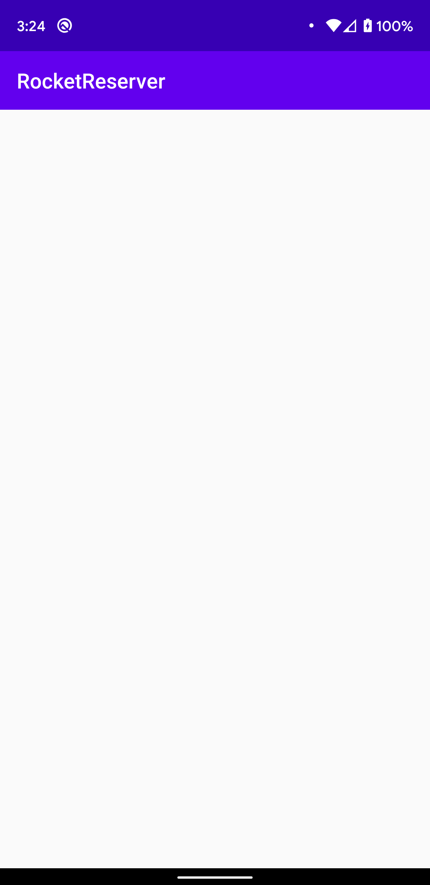
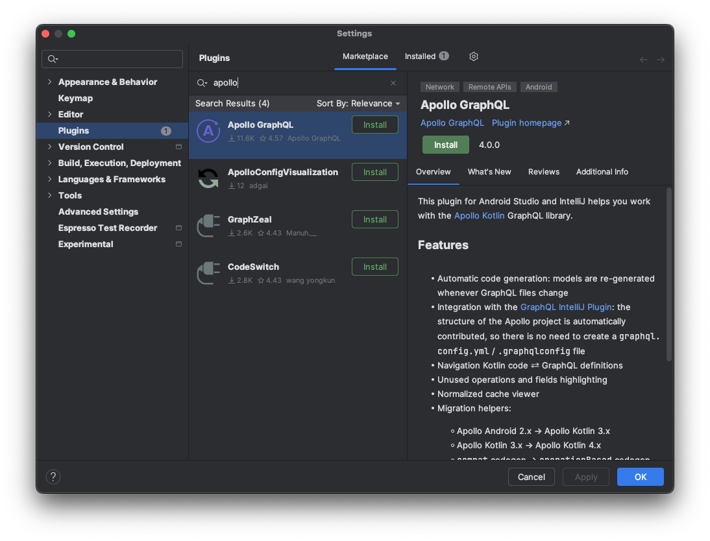

In this step, you'll import the starter project and add the Apollo Kotlin SDK to it.

## Clone the starter project

```
git clone https://github.com/apollographql/apollo-kotlin-tutorial
cd apollo-kotlin-tutorial
```

The starter project is in the `start` folder. 

At any time, if you want to view a completed version of the project, open the project in the `final` folder.

## Open the 'start' project in Android Studio

Android Studio will take some time to index the contents of the project. Take some time to look around. You should see 3 files:

* `LaunchList.kt` is the first screen. You will display a list of launches there.
* `LaunchDetails.kt` will display details about a launch and give you the opportunity to book a seat.
* `Login.kt` will allow you to log in before booking the seat.

Now build and run the project.

You should see a list with static placeholder data:



Now let's add Apollo Kotlin to the project.

## Install the Android Studio Plugin (optional)

We recommend installing the [Android Studio Plugin](https://www.apollographql.com/docs/kotlin/testing/android-studio-plugin/) to benefit from autocomplete in your `.graphql`, live code generation and more.

Go to `Android Studio` -> `Setting...` -> `Plugins`. In the "Marketplace" tab, search for "Apollo" and install the Apollo Android Studio Plugin



## Get the latest version of Apollo Kotlin

You can find the latest version of Apollo Kotlin from the [GitHub releases page](https://github.com/apollographql/apollo-kotlin/releases). It is also displayed at the top of the [apollo-kotlin repo](https://github.com/apollographql/apollo-kotlin/).

This tutorial uses `4.1.0` because it is the latest version at the time of writing. Feel free to use a more recent version if one is available.

## Apply the plugin

Add the Apollo plugin to the version catalog in `gradle/libs.versions.toml`. The Apollo plugin ID is `com.apollographql.apollo`:

```toml title="gradle/libs.versions.toml"
[versions]
# ...
apollo = "4.0.0"

[plugins]
# ...
apollo = { id = "com.apollographql.apollo", version.ref = "apollo" }
```

Then apply the Apollo plugin in `app/build.gradle.kts`. There are two `build.gradle.kts` in the project - make sure to use the one in the `app` directory.

```kotlin title="app/build.gradle.kts"
plugins {
    alias(libs.plugins.android.application)
    // ...
    alias(libs.plugins.apollo)
}
```

The plugin contains the compiler that will generate models from your queries when you build your project.

## Configure the Apollo Gradle plugin

Configure the Apollo plugin to specify the package in which the Kotlin files will be generated. Put this at the end of `app/build.gradle.kts`:

```kotlin title="app/build.gradle.kts"
apollo {
  service("service") {
    packageName.set("com.example.rocketreserver")
  }
}
```

> Notice the `service` block: Apollo Kotlin supports configuring several services, which is useful if you have several GraphQL endpoints. In this tutorial there is only one, so you can name it anything you want (here we call it `"service"`). 

## Add dependencies

Now add `apollo-runtime` to the list of dependencies. This is the part of the SDK that executes queries and parses responses.

First add the dependency to the version catalog:

```toml title="gradle/libs.versions.toml"
[libraries]
# ...
apollo-runtime = { module = "com.apollographql.apollo:apollo-runtime", version.ref = "apollo"}
```

Then add the dependency to the `app/build.gradle.kts` file:

```kotlin title="app/build.gradle.kts"
dependencies {
    // ...
  implementation(libs.apollo.runtime)
}
```

Android Studio will display a yellow banner, `A project sync may be necessary for the IDE to work properly.` Click **Sync Now**.

If everything goes well, Apollo Kotlin is now added to your project. Next, you will [add the GraphQL schema to the project](02-add-the-graphql-schema).
