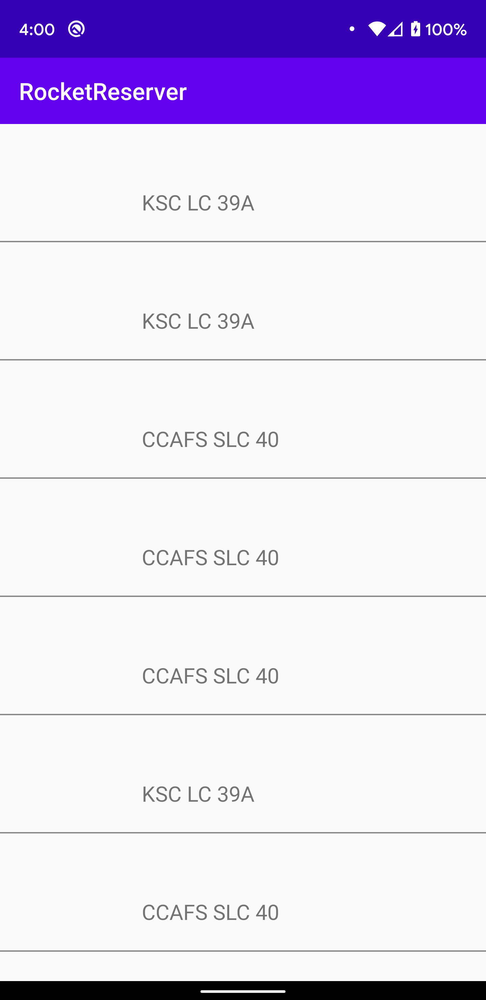

In this chapter, you are going to display a list of Launches in a [LazyColumn](https://developer.android.com/jetpack/compose/lists#lazy).

## Setup the LaunchList composable

In `LaunchList`, declare a list of `LaunchListQuery.Launch`, initialized as empty:

```kotlin title="app/src/main/java/com/example/rocketreserver/LaunchList.kt"
@Composable
fun LaunchList(onLaunchClick: (launchId: String) -> Unit) {
  var launchList by remember { mutableStateOf(emptyList<LaunchListQuery.Launch>()) }
```

`LaunchListQuery.Launch` is a typesafe generated model from your LaunchList.graphql query.

## Make a UI for the items

Update the `LaunchItem` composable to pass it a `LaunchListQuery.Launch` and display the id:

```kotlin title="app/src/main/java/com/example/rocketreserver/LaunchList.kt"
@Composable
private fun LaunchItem(launch: LaunchListQuery.Launch, onClick: (launchId: String) -> Unit) { // highlight-line
    ListItem(
        modifier = Modifier.clickable { onClick(launch.id) }, // highlight-line
        headlineText = {
            // Mission name
            Text(text = "Launch ${launch.id}") // highlight-line
        },
```

## Use the data in the list

Fill `launchList` with the data from the response, and use it in the LazyColumn:

```kotlin title="app/src/main/java/com/example/rocketreserver/LaunchList.kt"
@Composable
fun LaunchList(onLaunchClick: (launchId: String) -> Unit) {
  var launchList by remember { mutableStateOf(emptyList<LaunchListQuery.Launch>()) } // highlight-line
  LaunchedEffect(Unit) {
    val response = apolloClient.query(LaunchListQuery()).execute()
    launchList = response.data?.launches?.launches?.filterNotNull() ?: emptyList() // highlight-line
  }

  LazyColumn {
    items(launchList) { launch -> // highlight-line
      LaunchItem(launch = launch, onClick = onLaunchClick)
    }
  }
}
```

> **Note:** the `.filterNotNull()` is necessary because the schema defines `launches` as a list of _nullable_ `Launch` objects.

## Test your query

Hit the **Run** button. You now have a UI connected to your GraphQL queries 🚀



It looks a bit plain, though. Next, you'll [add more info](./06-add-more-info) to the list to make it look nicer!
