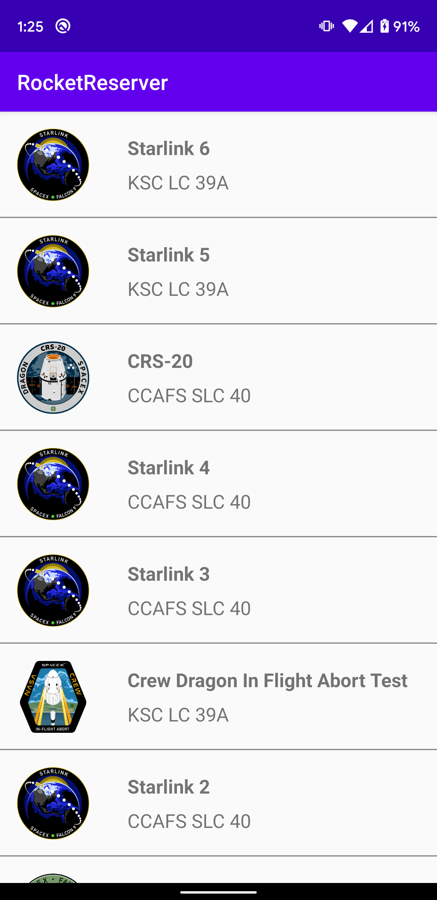

In this section, you will use the [Coil](https://github.com/coil-kt/coil) image-loading library to display a nice patch about the launch. You will also learn about GraphQL arguments.

## Add more info to your query

Go back to **LaunchList.graphql**. Your query is already fetching most of the information you want to display, but it would be nice to display both the name of the mission and an image of the patch.

Looking at the schema in Sandbox, you can see that `Launch` has a `mission` property, which allows you to get details of the mission. A mission has both a name and a `missionPatch` property, and the `missionPatch` can optionally take a parameter to specify the desired image size.

Because loading a LazyList with large images can impact performance, ask for the name and a `SMALL` mission patch. Update your query to look like the following:

```graphql title="app/src/main/graphql/LaunchList.graphql"
query LaunchList {
  launches {
    launches {
      id
      site
      mission {
        name
        missionPatch(size: SMALL)
      }
    }
  }
}

```

When you recompile, if you look in `LaunchListQuery.kt`, you'll see a new nested type, `Mission`, with the two properties you requested.

Any GraphQL field can take arguments like `missionPatch` above, and arguments can be of scalar or complex types. In this case, `SMALL` is an enum in the GraphQL schema. It can take a finite list of values. If you look at the Schema section in Sandbox, you can see a list of the enums. You can then click in to see that `PatchSize` can only take two values: `SMALL` and `LARGE`


## Display the fields

In `LaunchList.kt`, bind the GraphQL data to the mission name, site, and mission patch using Coil's `AsyncImage`:

```kotlin title="app/src/main/java/com/example/rocketreserver/LaunchList.kt"
@Composable
private fun LaunchItem(launch: LaunchListQuery.Launch, onClick: (launchId: String) -> Unit) {
  ListItem(
      modifier = Modifier.clickable { onClick(launch.id) },
      headlineText = {
        // Mission name
        Text(text = launch.mission?.name ?: "") // highlight-line
      },
      supportingText = {
        // Site
        Text(text = launch.site ?: "") // highlight-line
      },
      leadingContent = {
        // Mission patch
        AsyncImage( // highlight-line
            modifier = Modifier.size(68.dp, 68.dp),
            model = launch.mission?.missionPatch,
            placeholder = painterResource(R.drawable.ic_placeholder),
            error = painterResource(R.drawable.ic_placeholder),
            contentDescription = "Mission patch"
        )
      }
  )
}
```

## Test your query

Build and run the application, and you will see all the information for current launches.



If you scroll down, you'll see the list includes only about 20 launches. This is because the list of launches is **paginated**, and you've only fetched the first page.

Next, you will [use a cursor-based loading system to load the entire list of launches](./07-paginate-results/).
