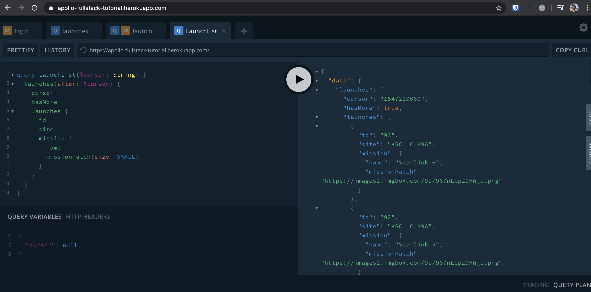

As you might have noticed, the object returned from the `LaunchListQuery` is a `LaunchConnection`. This object has a list of launches, a pagination cursor, and a boolean to indicate whether more launches exist.

When using a cursor-based pagination system, it's important to remember that the cursor gives you a place where you can get all results after a certain spot, regardless of whether more items have been added in the interim.

In the previous section, you hardcoded the `SMALL` size argument directly in the GraphQL query, but you can also define arguments programmatically using variables. You will use them here to implement pagination.

## add a `cursor` variable

In `LaunchList.graphql`, add a `cursor` variable. In GraphQL, variables are prefixed with the dollar sign, like so:

```graphql:title=app/src/main/graphql/com/example/rocketreserver/LaunchList.graphql
query LaunchList($cursor: String) {
  launches(after: $cursor) {
    cursor
    hasMore
    launches {
      id
      site
      mission {
        name
        missionPatch(size: SMALL)
      }
    }
  }
}
```

You can experiment with GraphQL variables in GraphQL Playground by using the lower-left pane named **Query variables**. If you omit the `$cursor` variable, the server returns data starting from the beginning.




## Get a callback when more data is needed

modify `LaunchListAdapter.kt` to get a callback when the end of the list is reached:

```kotlin:title=app/src/main/java/com/example/rocketreserver/LaunchListAdapter.kt
    var onEndOfListReached: (() -> Unit)? = null

    override fun onBindViewHolder(holder: ViewHolder, position: Int) {
        val launch = launches.get(position)
        // ...

        if (position == launches.size - 1) {
            onEndOfListReached?.invoke()
        }
    }

```

Note that you can add some look-ahead and trigger the callback before the end of list is reached if you want to minimize the wait time and trigger a new network requests a few items before the end of list is reached.
This is a basic implementation of a paging adapter - in a real project you would probably use something like the [Jetpack Paging library](https://developer.android.com/topic/libraries/architecture/paging/v3-overview).

## Connect to the callback

In `LaunchListFragment.kt`, register this callback and link it to a coroutine [Channel](https://kotlinlang.org/docs/reference/coroutines/channels.html):

```kotlin:title=app/src/main/java/com/example/rocketreserver/LaunchListFragment.kt
        val launches = mutableListOf<LaunchListQuery.Launch>()
        val adapter = LaunchListAdapter(launches)
        binding.launches.layoutManager = LinearLayoutManager(requireContext())
        binding.launches.adapter = adapter

        val channel = Channel<Unit>(Channel.CONFLATED)

        // Send a first item to do the initial load else the list will stay empty forever
        channel.trySend(Unit)
        adapter.onEndOfListReached = {
            channel.trySend(Unit)
        }
```

`Channel`s are useful for communicating between coroutines. In this case, the channel does not transfer any real data besides the information that the end of list has been reached. For this it uses the `Unit` data type. Every time a `Unit` object is read from the channel, it means the adapter might need more data.

Also note that the channel is [CONFLATED](https://play.kotlinlang.org/hands-on/Introduction%20to%20Coroutines%20and%20Channels/08_Channels). A conflated channel will drop items if the consumer cannot proceed through them fast enough. In this case, if the user scrolls up and down while a query is still in flight, you don't want to buffer these requests to replay them later, so it's fine to drop them.

## Execute the paginated query

Start a coroutine and execute the query. Replace the previous single query with the paginated version:

```kotlin:title=app/src/main/java/com/example/rocketreserver/LaunchListFragment.kt
  lifecycleScope.launchWhenResumed {
      var cursor: String? = null
      for (item in channel) {
          val response = try {
              apolloClient.query(LaunchListQuery(cursor = Input.fromNullable(cursor))).await()
          } catch (e: ApolloException) {
              Log.d("LaunchList", "Failure", e)
              return@launchWhenResumed
          }

          val newLaunches = response.data?.launches?.launches?.filterNotNull()

          if (newLaunches != null) {
              launches.addAll(newLaunches)
              adapter.notifyDataSetChanged()
          }

          cursor = response.data?.launches?.cursor
          if (response.data?.launches?.hasMore != true) {
              break
          }
      }

      adapter.onEndOfListReached = null
      channel.close()
  }
```

Coroutines help you write pagination as if it were a procedural `while` loop. Notice how the cursor is updated at each iteration and the loop is terminated if there is no data to get from the backend anymore (`hasMore == false`)


## Test scrolling

Click **Run**. You can now see all the scheduled launches!

Next, you'll [add a details view](08-add-a-details-view) that will allow you to book a seat on a launch.
