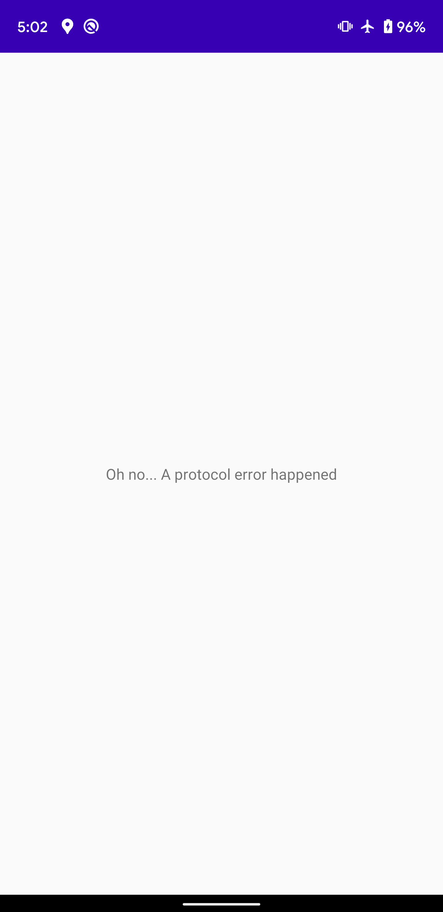
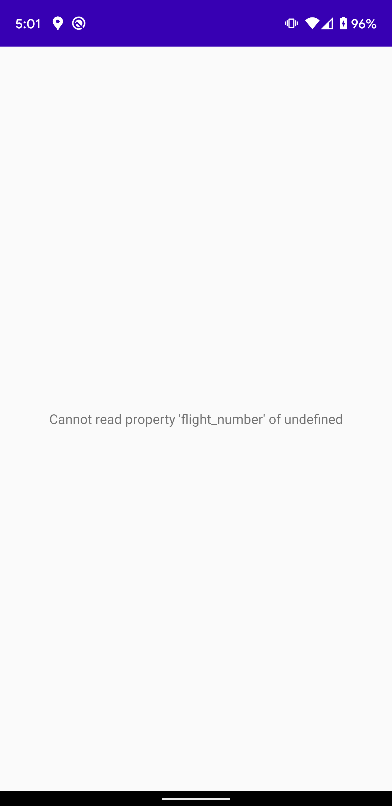
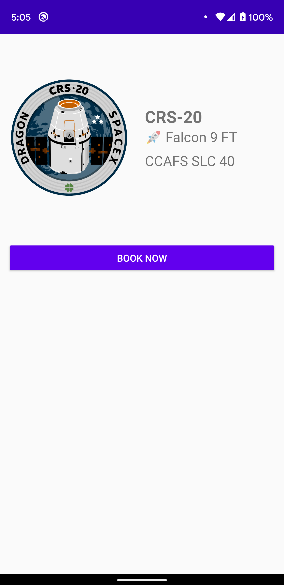

In this section, you'll write a second GraphQL query that requests details about a single launch.

## Open the details fragment from the list

In `LaunchListAdapter.kt`, add a click listener:

```kotlin:title=app/src/main/java/com/example/rocketreserver/LaunchListAdapter.kt
    var onEndOfListReached: (() -> Unit)? = null
    var onItemClicked: ((LaunchListQuery.Launch) -> Unit)? = null

    override fun onBindViewHolder(holder: ViewHolder, position: Int) {

        // ...

        holder.binding.root.setOnClickListener {
            onItemClicked?.invoke(launch)
        }
    }
```

In `LaunchListFragment.kt`, register a click listener and navigate to the details screen:

```kotlin:title=app/src/main/java/com/example/rocketreserver/LaunchListFragment.kt
    override fun onViewCreated(view: View, savedInstanceState: Bundle?) {

        // ...

        adapter.onItemClicked = { launch ->
            findNavController().navigate(
                LaunchListFragmentDirections.openLaunchDetails(launchId = launch.id)
            )
        }
    }
```

## Create the details query

Create a new GraphQL query named `LaunchDetails.graphql`.

As you did for `$cursor`, add a variable named `id`. Notice that this variable is a non-optional type this time. You won't be able to pass `null` like you can for `$cursor`.

Because it's a details view, request the `LARGE` size for the missionPatch. Also request the rocket type and name:

```graphql:title=app/src/main/graphql/com/example/rocketreserver/LaunchDetails.graphql
query LaunchDetails($id:ID!) {
  launch(id: $id) {
    id
    site
    mission {
      name
      missionPatch(size:LARGE)
    }
    rocket {
      name
      type
    }
    isBooked
  }
}
```

Remember you can always experiment in GraphQL Playground and type `Ctrl + Space` to show a list of fields that are available.

## Show a loading ProgressBar

In `LaunchDetailsFragment.kt`, override `onViewCreated` and launch a new coroutine

This time, display a progressBar while the query executes:

```kotlin:title=app/src/main/java/com/example/rocketreserver/LaunchDetailsFragment.kt
    override fun onViewCreated(view: View, savedInstanceState: Bundle?) {
        super.onViewCreated(view, savedInstanceState)

        lifecycleScope.launchWhenResumed {
            binding.bookButton.visibility = View.GONE
            binding.bookProgressBar.visibility = View.GONE
            binding.progressBar.visibility = View.VISIBLE
            binding.error.visibility = View.GONE

            val response = apolloClient.query(LaunchDetailsQuery(id = args.launchId)).await()
```

## Handle protocol errors

As you execute your query, two types of errors can happen:

* Protocol errors. HTTP errors or JSON parsing errors will throw a `ApolloException`.
* Application errors. In this case, `response.errors` will contain the application errors and `response.data` might be `null`.

For protocol errors, Apollo Android will throw an `ApolloException`, so you'll need to wrap the call in a try/catch block:

```
            val response = try {
                apolloClient.query(LaunchDetailsQuery(id = args.launchId)).await()
            } catch (e: ApolloException) {
                binding.progressBar.visibility = View.GONE
                binding.error.text = "Oh no... A protocol error happened"
                binding.error.visibility = View.VISIBLE
                return@launchWhenResumed
            }
```

Enable airplane mode before clicking the details of a launch. You should see this:



This is good! But it's not enough. Even if the request executes correctly at the protocol level, it might also contain application errors that are specific to your server.

## Handle application errors

To handle application errors, you can check `response.hasErrors`:

```kotlin:title=app/src/main/java/com/example/rocketreserver/LaunchDetailsFragment.kt
            val launch = response.data?.launch
            if (launch == null || response.hasErrors()) {
                binding.progressBar.visibility = View.GONE
                binding.error.text = response.errors?.get(0)?.message
                binding.error.visibility = View.VISIBLE
                return@launchWhenResumed
            }
```

`response.errors` contains details about any errors that occurred. Note that this code also checks for `response.data == null`. In theory, a server should not set `response.data == null` and `response.hasErrors == false` at the same time, but the type system cannot guarantee this.

To trigger an error, replace `LaunchDetailsQuery(id = args.launchId)` with `LaunchDetailsQuery(id = "invalidId")`. Disable airplane mode and select a launch. The server will send this response:

```json:title=(error)
{
  "errors": [
    {
      "message": "Cannot read property 'flight_number' of undefined",
      "locations": [
        {
          "line": 1,
          "column": 32
        }
      ],
      "path": [
        "launch"
      ],
      "extensions": {
        "code": "INTERNAL_SERVER_ERROR"
      }
    }
  ],
  "data": {
    "launch": null
  }
}
```



This is all good! You can use the `error` field to add more advanced error management.

Restore the correct launch ID: `LaunchDetailsQuery(id = args.launchId)` before displaying details.

## Display details

If no errors occurred, hide the progressBar and display the detailed information:

```kotlin:title=app/src/main/java/com/example/rocketreserver/LaunchDetailsFragment.kt
            binding.progressBar.visibility = View.GONE

            binding.missionPatch.load(launch.mission?.missionPatch) {
                placeholder(R.drawable.ic_placeholder)
            }
            binding.site.text = launch.site
            binding.missionName.text = launch.mission?.name
            val rocket = launch.rocket
            binding.rocketName.text = "🚀 ${rocket?.name} ${rocket?.type}"
        }
    }
```

## Handle the **Book now** button

Add a `configureButton` method that redirects to the login page:

```kotlin:title=app/src/main/java/com/example/rocketreserver/LaunchDetailsFragment.kt
    override fun onViewCreated(view: View, savedInstanceState: Bundle?) {
        super.onViewCreated(view, savedInstanceState)

        lifecycleScope.launchWhenResumed {

          // ...

          configureButton(launch.isBooked)
        }
    }

    private fun configureButton(isBooked: Boolean) {
        binding.bookButton.visibility = View.VISIBLE
        binding.bookProgressBar.visibility = View.GONE

        binding.bookButton.text = if (isBooked) {
            getString(R.string.cancel)
        } else {
            getString(R.string.book_now)
        }

        binding.bookButton.setOnClickListener {
            if (User.getToken(requireContext()) == null) {
                findNavController().navigate(
                    R.id.open_login
                )
                return@setOnClickListener
            }
        }
    }
```

## Test your query

Hit **Run**. Your screen should look like this:



Right now, you aren't logged in, so `isBooked` will always be `false` and you won't be able to book a trip.

Next, you will [write your first mutation](09-write-your-first-mutation) to log in to the backend.
