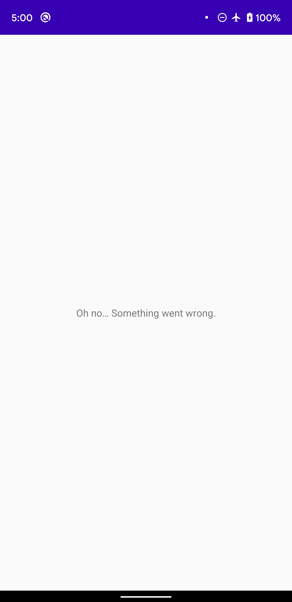

In this section, you will write your second GraphQL query to request details about a single launch. You will also learn how to handle loading states and errors.

## Open the details fragment from the list

In `LaunchListAdapter.kt`, add a click listener:

```kotlin:title=app/src/main/java/com/example/rocketreserver/LaunchListAdapter.kt
    var onEndOfListReached: (() -> Unit)? = null
    var onItemClicked: ((LaunchListQuery.Launch) -> Unit)? = null

    override fun onBindViewHolder(holder: ViewHolder, position: Int) {

        // ...

        holder.binding.root.setOnClickListener {
            onItemClicked?.invoke(launch)
        }
    }
```

In `LaunchListFragment.kt`, register a click listener and navigate to the details screen:

```kotlin:title=app/src/main/java/com/example/rocketreserver/LaunchListFragment.kt
    override fun onViewCreated(view: View, savedInstanceState: Bundle?) {

        // ...

        adapter.onItemClicked = { launch ->
            findNavController().navigate(
                LaunchListFragmentDirections.openLaunchDetails(launchId = launch.id)
            )
        }
    }
```

## Create the details query

Create a new GraphQL query named `LaunchDetails.graphql`.

As you did for $cursor, add a variable named `id`. Notice that this variable is a non-optional type this time. You won't be able to pass `null` like for $cursor.

Since it is a details view, request the `LARGE` size for the missionPatch and also request the rocket type and name:

```graphql:title=app/src/main/graphql/com/example/rocketreserver/LaunchDetails.graphql
query LaunchDetails($id:ID!) {
  launch(id: $id) {
    id
    site
    mission {
      name
      missionPatch(size:LARGE)
    }
    rocket {
      name
      type
    }
    isBooked
  }
}
```

Remember you can always experiment in GraphiQL and type `Ctrl + Space` in GraphiQL to have a list of fields that are available.

## Show a loading ProgressBar

In `LaunchDetailsFragment.kt`, override `onViewCreated` and launch a new coroutine

This time, display a progressBar while the query executes:

```kotlin:title=app/src/main/java/com/example/rocketreserver/LaunchDetailsFragment.kt
    override fun onViewCreated(view: View, savedInstanceState: Bundle?) {
        super.onViewCreated(view, savedInstanceState)

        lifecycleScope.launchWhenResumed {
            binding.bookButton.visibility = View.GONE
            binding.bookProgressBar.visibility = View.GONE
            binding.progressBar.visibility = View.VISIBLE
            binding.error.visibility = View.GONE

            val response = try {
                apolloClient.query(LaunchDetailsQuery(id = args.launchId)).toDeferred().await()
            } catch (e: ApolloException) {
                null
            }
```

## Handle errors

As you execute your query, three types of errors can happen:

* Protocol errors such as HTTP or Json parsing errors will throw a `ApolloException`
* Application errors. In this case, `response.errors` will contain the application errors
* Finally the client might not be ready to handle any type of returned data, especially null fields.

Protocol errors are handled by the try/catch above but you should also be prepared to handle the case were there are null fields or application errors:

```kotlin:title=app/src/main/java/com/example/rocketreserver/LaunchDetailsFragment.kt
            val launch = response?.data?.launch
            if (launch == null || response.hasErrors()) {
                Log.d("LaunchDetails", "Failure")
                binding.progressBar.visibility = View.GONE
                binding.error.visibility = View.VISIBLE
                return@launchWhenResumed
            }
```

You can test error handling by enabling airplane mode before clicking the details of a launch.



This is good!

## Display details

If no errors happened, hide the progressBar and display the detailed information:

```kotlin:title=app/src/main/java/com/example/rocketreserver/LaunchDetailsFragment.kt
            binding.progressBar.visibility = View.GONE

            binding.missionPatch.load(launch.mission?.missionPatch) {
                placeholder(R.drawable.ic_placeholder)
            }
            binding.site.text = launch.site
            binding.missionName.text = launch.mission?.name
            val rocket = launch.rocket
            binding.rocketName.text = "🚀 ${rocket?.name} ${rocket?.type}"
        }
    }
```

## Handle the **Book now** button

Add a `configureButton` method that redirects to the login page:

```kotlin:title=app/src/main/java/com/example/rocketreserver/LaunchDetailsFragment.kt
    override fun onViewCreated(view: View, savedInstanceState: Bundle?) {
        super.onViewCreated(view, savedInstanceState)

        lifecycleScope.launchWhenResumed {

          // ...

          configureButton(launch.isBooked)
        }
    }

    private fun configureButton(isBooked: Boolean) {
        binding.bookButton.visibility = View.VISIBLE
        binding.bookProgressBar.visibility = View.GONE

        binding.bookButton.text = if (isBooked) {
            getString(R.string.cancel)
        } else {
            getString(R.string.book_now)
        }

        binding.bookButton.setOnClickListener {
            val context = context
            if (context != null && User.getToken(context) == null) {
                findNavController().navigate(
                    R.id.open_login
                )
                return@setOnClickListener
            }
        }
    }
```

## Test your query

Hit **Run**. Your screen should look like this:


Right now, you are unlogged so `isBooked` will always be false and you won't be able to book a trip

Next, you will [write your first mutation](09-write-your-first-mutation) to log in to the backend.