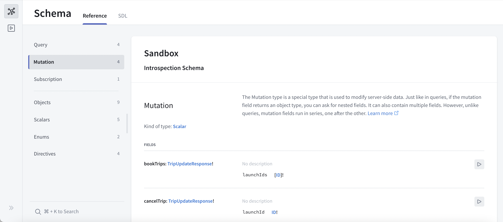
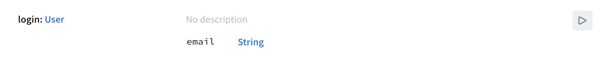
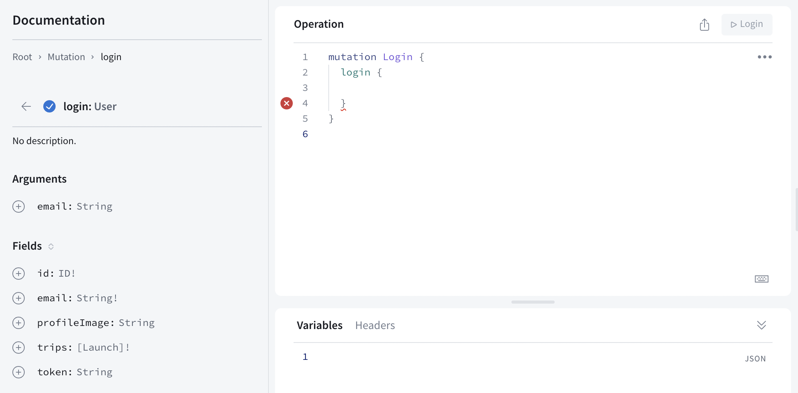
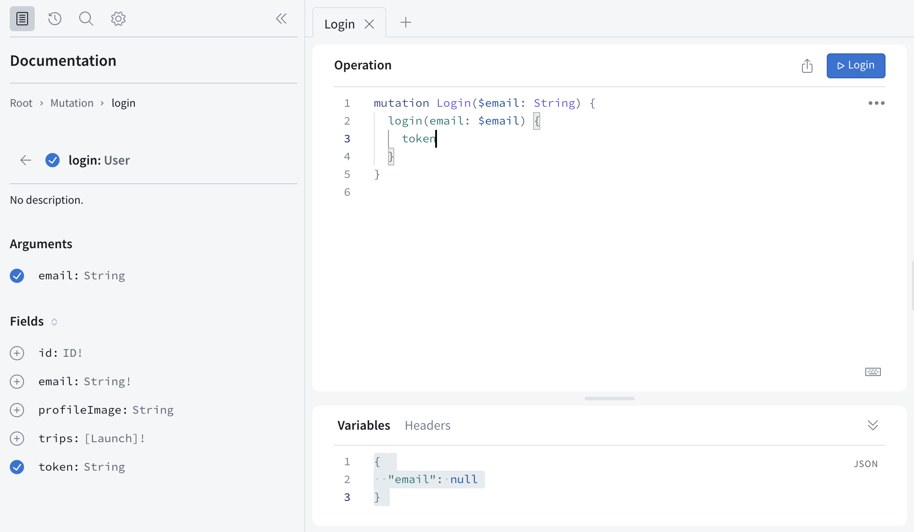
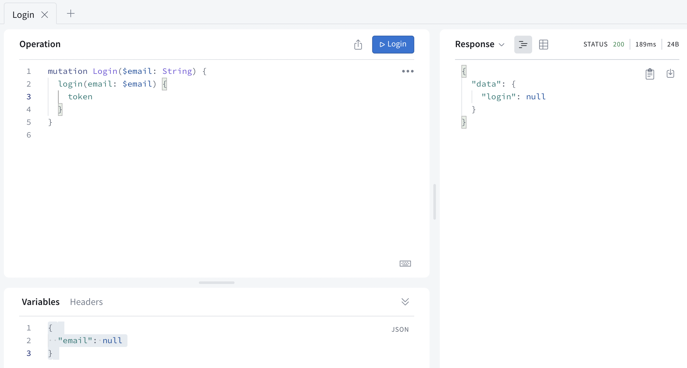
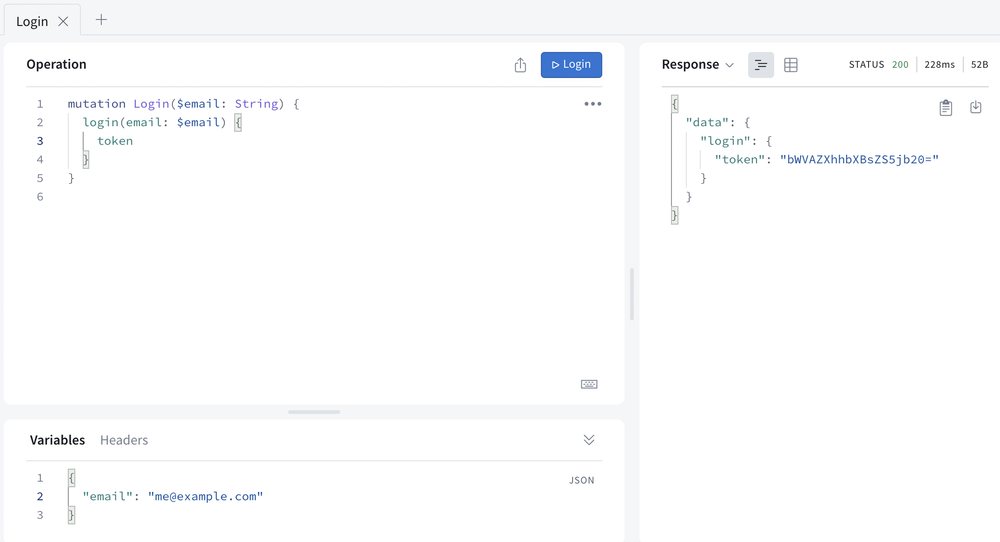
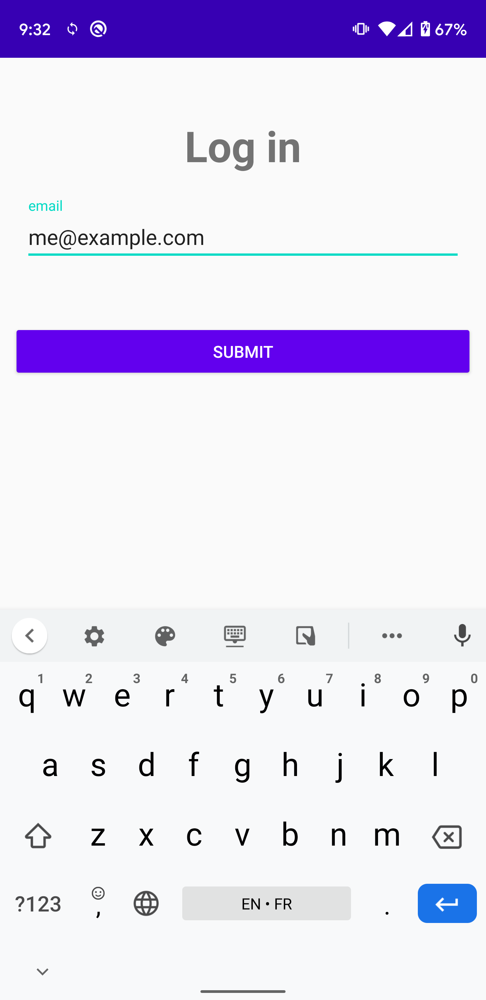

In this section, you will write your first mutation to log in to the backend.

A mutation is used to change data on your server. Here the login mutation will create a session based on your email address.

> **Note**: The way you log in to this particular server might differ from the way you log in with your own server. Login is often handled by _middleware_, or a layer totally separate from GraphQL, like [Oauth](https://en.wikipedia.org/wiki/OAuth).
> Also note that a typical authentication flow should require a password but for this tutorial, anyone is allowed to book flights with a valid email address!


## Prototype your mutation in Sandbox Explorer

Open [your Sandbox Explorer](https://studio.apollographql.com/sandbox/explorer?endpoint=https%3A%2F%2Fapollo-fullstack-tutorial.herokuapp.com%2Fgraphql) and click on the plus symbol to add a new tab. Next, click on the Schema icon to get back to looking at your schema, and select "Mutation" to look at your list of mutation fields:



Scroll down to take a look at the `login` field:



Click the play button to the right to open that field in the Explorer tab. When it opens, click the plus sign to add field to your operation:



Notice the red error indication - this is because the type returned by the field is `User`, which is not a **leaf** type: you need to choose which of the user's fields the mutation will return. For our purposes, we only need the `token` field, so add it by clicking the plus sign next to it.

You'll also notice that `email` wasn't automatically added as an argument even though it doesn't seem to have a default value: that's because `email` is of type `String` - which remember, in GraphQL, means that it's **not** required (although obviously you won't get too far without it).

Click the plus sign next to the `email` argument to have that argument added:



You'll also notice that Sandbox Explorer has added a variable to your "Variables" section to match the login email.

Click the Submit Operation button to execute your mutation. You'll see that since you sent `null` for the email address, you get back `null` for the login:



Now, replace `null` in the Query Variables section with an actual email address:

```json title="(Sandbox Explorer)"
{ "email": "me@example.com" }
```

Press the Submit Operation button, and this time you'll get an actual response:



Next, copy the operation, either manually or using the three-dot menu's "Copy operation" option.

## Add the mutation to the project

Now that your mutation is working, add it to your project. Create a file named `Login.graphql` next to `schema.graphqls` and your other GraphQL files and paste the contents of the mutation:

```graphql title="app/src/main/graphql/Login.graphql"
mutation Login($email: String!) {
  login(email: $email) {
    token
  }
}
```
Note: we've also marked the `email` variable as non-nullable by adding `!` to the end of the type, since we always want to pass a value for it.

Build your project to generate the `LoginMutation` class.

## Connect the Submit button to your mutation

To navigate back to the previous screen after logging-in, add a `navigateBack` lambda parameter to the `Login` composable:

```kotlin title="app/src/main/java/com/example/rocketreserver/Login.kt"
@Composable
fun Login(navigateBack: () -> Unit) { // highlight-line
```

Again, it should be initialized in `MainActivity`:
    
```kotlin title="app/src/main/java/com/example/rocketreserver/MainActivity.kt"
composable(route = NavigationDestinations.LOGIN) {
    Login(
        navigateBack = { // highlight-line
            navController.popBackStack() // highlight-line
        } // highlight-line
    )
}
```

Go back to `Login.kt` and create a function to execute the Login mutation:

```kotlin title="app/src/main/java/com/example/rocketreserver/Login.kt"
private suspend fun login(email: String): Boolean {
    val response = apolloClient.mutation(LoginMutation(email = email)).execute()
    return when {
        response.exception != null -> {
            Log.w("Login", "Failed to login", response.exception)
            false
        }
    
        response.hasErrors() -> {
            Log.w("Login", "Failed to login: ${response.errors?.get(0)?.message}")
            false
        }
    
        response.data?.login?.token == null -> {
            Log.w("Login", "Failed to login: no token returned by the backend")
            false
        }
    
        else -> {
            TokenRepository.setToken(response.data!!.login!!.token!!)
            true
        }
    }
}
```
The possible error cases are handled and a boolean is returned to indicate if the login was successful or not. If it was, the token is saved in the `TokenRepository`.

Note that the function is marked as `suspend` and so will need to be called from a coroutine. To do that, declare a scope in `Login`:

```kotlin title="app/src/main/java/com/example/rocketreserver/Login.kt"
// Submit button
val scope = rememberCoroutineScope()
```

Then, in the `onClick` lambda, replace the `TODO` with a call to `login()`, and handle the result:

```kotlin title="app/src/main/java/com/example/rocketreserver/Login.kt"
Button(
    modifier = Modifier
        .padding(top = 32.dp)
        .fillMaxWidth(),
    onClick = {
        scope.launch { // highlight-line
            val ok = login(email) // highlight-line
            if (ok) navigateBack() // highlight-line
        } // highlight-line
    }
) {
    Text(text = "Submit")
}
```

To improve the UX, add a loading indicator that will be shown while the login is in progress (let's also disable the button to avoid multiple clicks):

```kotlin title="app/src/main/java/com/example/rocketreserver/Login.kt"
// Submit button
var loading by remember { mutableStateOf(false) } // highlight-line
val scope = rememberCoroutineScope()
Button(
    modifier = Modifier
        .padding(top = 32.dp)
        .fillMaxWidth(),
    enabled = !loading, // highlight-line
    onClick = {
        loading = true // highlight-line
        scope.launch {
            val ok = login(email)
            loading = false // highlight-line
            if (ok) navigateBack()
        }
    }
) {
    if (loading) { // highlight-line
        Loading() // highlight-line
    } else { // highlight-line
        Text(text = "Submit")
    }
}
```

## Test the login

Go to the details screen, click **Book** and in the Login screen, enter your email and click **Submit**. You now have a token that allows you to authenticate your operations.



In the next section, you will [use authenticated operations to book a flight](10-authenticate-your-queries).
