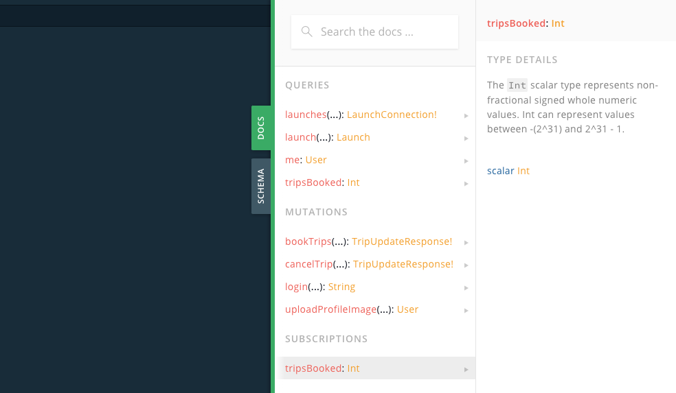
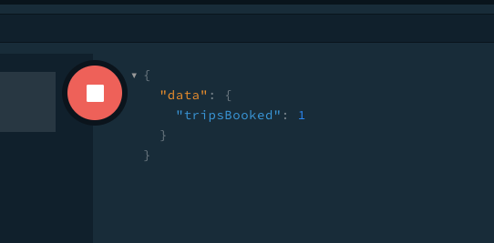
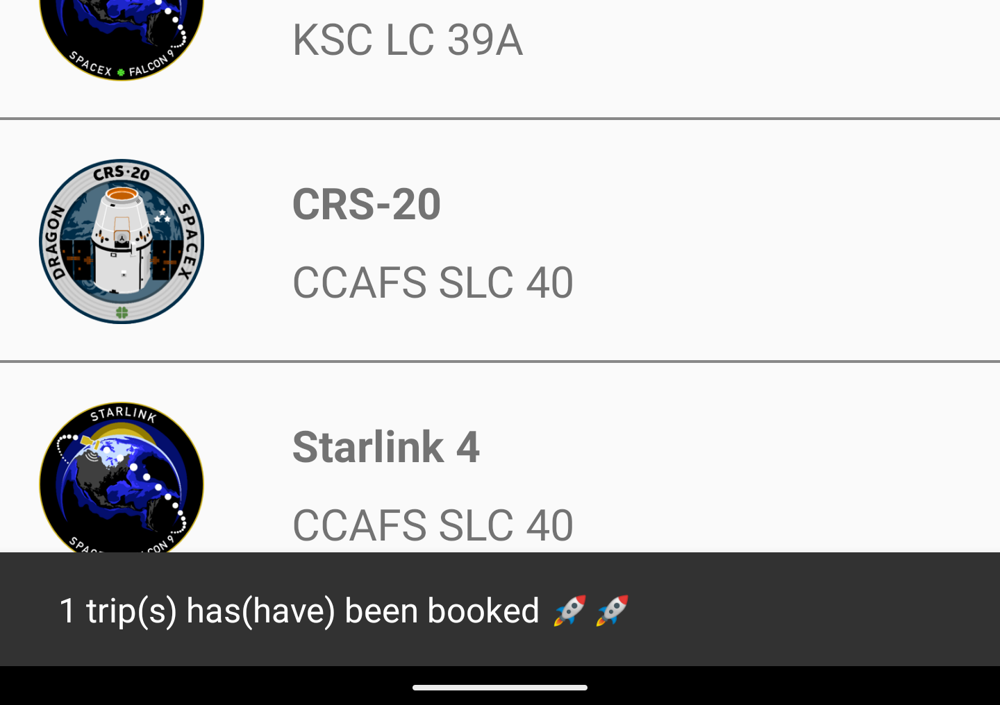

In this section, you will use subscriptions to get notified whenever someone books a flight 🚀! [Subscriptions](https://graphql.org/blog/subscriptions-in-graphql-and-relay/) allow to be notified in real time whenever an event happens on your server. The [fullstack backend](https://apollo-fullstack-tutorial.herokuapp.com) supports subscriptions based on [WebSockets](https://en.wikipedia.org/wiki/WebSocket).


## Write your subscription

Open [GraphQL Playground](https://apollo-fullstack-tutorial.herokuapp.com/) and open the docs tab on the right. In addition to `queries` and `mutations`, you will see a third type of operations, `subscriptions`. Click the `tripsBooked` subscription:



This subscription doesn't take any argument and returns a single scalar named `tripsBooked`. Since the you can book multiple trips at once, `tripsBooked` is an Int. It will contain the number of trips booked at once or -1 if a trip has been cancelled.

Type the following subscription in the left panel:

```graphql
subscription {
  tripsBooked
}
```

Click the Play button, your subscription will start listening to events.

## Test your subscription with GraphQL Playground

Leave this tab open and open [GraphQL Playground](https://apollo-fullstack-tutorial.herokuapp.com/) in a new one. In this new tab, book a trip like on [step 9](09-write-your-first-mutation):

```graphql
mutation {
  bookTrips(launchIds: ["83"]){
    message
  }
}
```

Do not forget to include the authentication header:

```json
{
  "Authorization": "The header you got from the login mutation"
}
```

Click the Play button. If everything went well, you just booked a trip. Go back to your subscription tab and you should see an event in the right panel:



Continue booking and/or canceling trips, you will see events coming in the subscription tab in real time. After some time, the server might close the connection and you'll have to restart your subscription to keep receiving events.

## Add the subscription to the project

Now that your subscription is working, add it to your project. Create a file named `TripsBooked.graphql` next to `schema.json` and your other GraphQL files and paste the contents of the subscription. The process is similar to what you did for queries and mutations:

```graphql:title=app/src/main/graphql/com/example/rocketreserver/TripsBooked.graphql
subscription TripsBooked {
  tripsBooked
}
```

## Configure your ApolloClient to use subscriptions

In `Apollo.kt`, add a `SubscriptionTransport.Factory` to your `ApolloClient`. Here it uses a `WebSocketSubscriptionTransport.Factory` and `OkHttp`:

```kotlin:title=Apollo.kt
    val okHttpClient = OkHttpClient.Builder()
        .addInterceptor(AuthorizationInterceptor(context))
        .build()

    instance = ApolloClient.builder()
        .serverUrl("https://apollo-fullstack-tutorial.herokuapp.com/graphql")
        .subscriptionTransportFactory(WebSocketSubscriptionTransport.Factory("wss://apollo-fullstack-tutorial.herokuapp.com/graphql", okHttpClient))
        .okHttpClient(okHttpClient)
        .build()
```

`wss://` is the protocol for WebSocket.

## Display a SnackBar when a trip is booked/cancelled

In `MainActivity`, register your subscription and start listening to events using coroutine Flows. Use a [Material SnackBar](https://material.io/develop/android/components/snackbar/) to display a small message coming from the bottom of the screen:

```kotlin:title=MainActivity.kt
    override fun onCreate(savedInstanceState: Bundle?) {
        super.onCreate(savedInstanceState)

        setContentView(R.layout.activity_main)

        lifecycleScope.launch {
            apolloClient(this@MainActivity).subscribe(TripsBookedSubscription()).toFlow()
                .collect {
                    val text = when (val trips = it.data?.tripsBooked) {
                        null -> getString(R.string.subscriptionError)
                        -1 -> getString(R.string.tripCancelled)
                        else -> getString(R.string.tripBooked, trips)
                    }
                    Snackbar.make(
                        findViewById(R.id.main_frame_layout),
                        text,
                        Snackbar.LENGTH_LONG
                    ).show()
                }
        }
    }
```

## Handle errors

Like for queries and mutations, the subscription will throw an error if the connection is lost or any other protocol error happens. To handle these situations, you can use [Flow.retry](https://kotlin.github.io/kotlinx.coroutines/kotlinx-coroutines-core/kotlinx.coroutines.flow/retry.html):

```MainActivity.kt
    apolloClient(this@MainActivity).subscribe(TripsBookedSubscription()).toFlow()
        .retryWhen { _, attempt ->
            delay(attempt * 1000)
            true
        }
        .collect {
            // ...
```

## Test your code

Build and run your app and go back to your second [GraphQL Playground](https://apollo-fullstack-tutorial.herokuapp.com/) tab. Book a new trip while your app is open, you should see a SnackBar 🚀:



This concludes the tutorial.

## More resources

Use the rest of this documentation for more advanced topics like [Caching](https://www.apollographql.com/docs/android/essentials/caching/)  or [Gradle configuration](https://www.apollographql.com/docs/android/essentials/plugin-configuration/).

Feel free to ask questions by either [opening an issue on our GitHub repo](https://github.com/apollographql/apollo-android/issues) or [stopping by our Spectrum Chat for help](https://spectrum.chat/apollo/apollo-android).

And if you want dig more and see GraphQL in real-life apps, you can take a look at these open source projects using Apollo Android:

* https://github.com/BoD/apollo-graphql-android-sample
* https://github.com/ZacSweers/CatchUp
