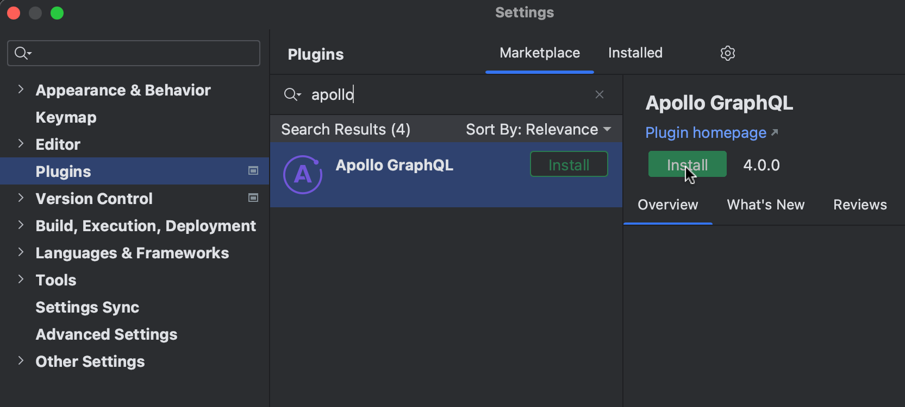
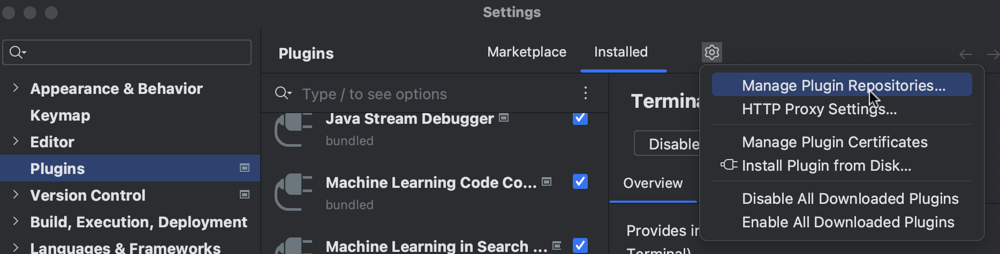
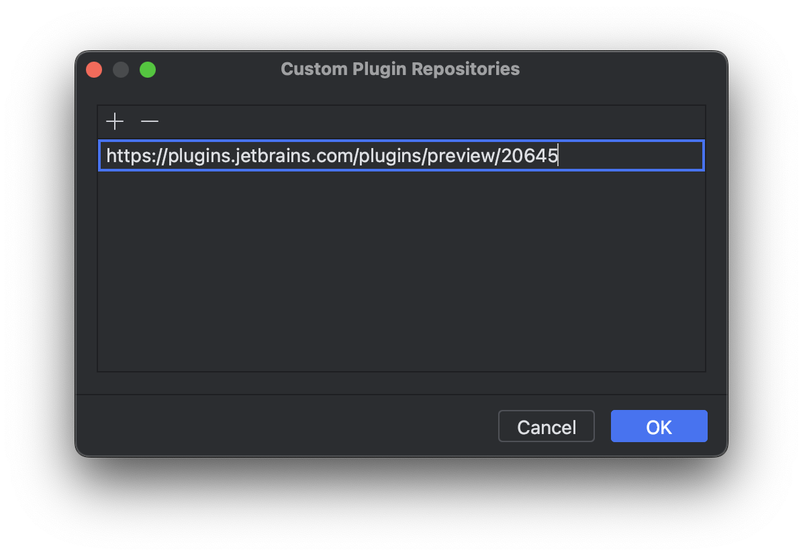

# Apollo IntelliJ Plugin

<!-- Plugin description -->

This plugin for Android Studio and IntelliJ helps you work with the
[Apollo Kotlin](https://github.com/apollographql/apollo-kotlin) GraphQL library.

## Features
- Automatic code generation: models are re-generated whenever GraphQL files change
- Integration with the [GraphQL IntelliJ Plugin](https://plugins.jetbrains.com/plugin/8097-js-graphql): the structure of the Apollo project is automatically contributed, so there is no need to create a `graphql.config.yml` / `.graphqlconfig` file
- Navigation Kotlin code ⇄ GraphQL definitions
- Unused operations and fields highlighting
- Normalized cache viewer
- Migration helpers:
  - Apollo Android 2.x → Apollo Kotlin 3.x
  - Apollo Kotlin 3.x → Apollo Kotlin 4.x
  - `compat` codegen → `operationBased` codegen
- More to come!

## Compatibility

- Most features are intended to work with Apollo Kotlin 4.x
- Automatic code generation works with Apollo Kotlin 3.x and above

<!-- Plugin description end -->

The plugin is supported on:

- IntelliJ 2024.2.1 and above
- Android Studio 2024.2.1 (Ladybug) and above

## Installation instructions

<kbd>Marketplace</kbd> > Search for "Apollo GraphQL" > <kbd>Install</kbd>

### Weekly snapshots

The plugin is published every Sunday in a specific **snapshots** repository. To use it, the repository URL must be
configured:

<kbd>Settings</kbd> > <kbd>Plugins</kbd> > <kbd>⚙</kbd>️ > <kbd>Manage Plugin
Repositories</kbd> > <kbd>+</kbd> > <kbd>https://go.apollo.dev/ij-plugin-snapshots</kbd>

Then search for "Apollo GraphQL" and install the plugin as usual.
